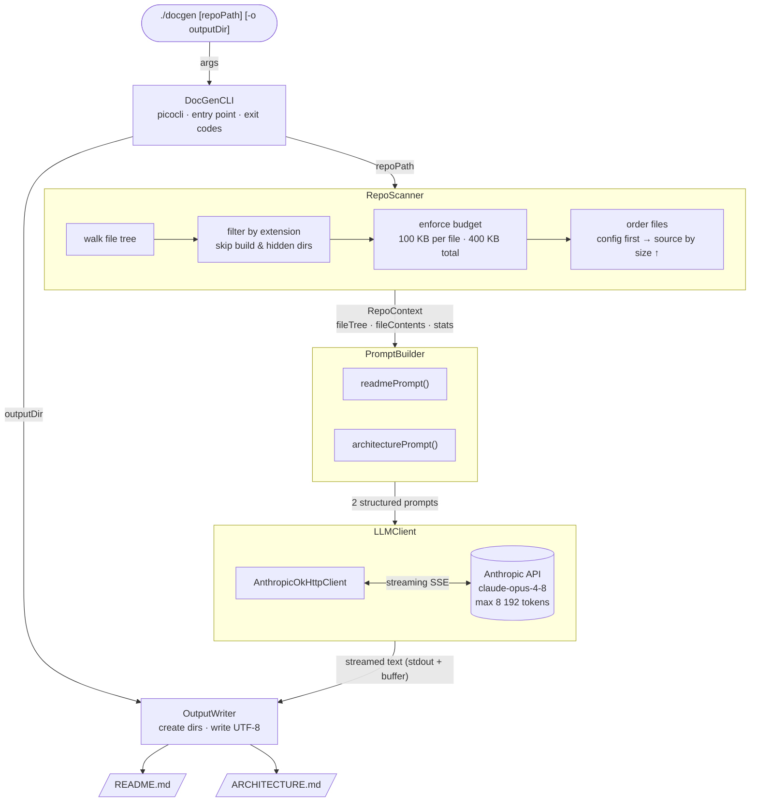

# Architecture

`docgen` is a single-command CLI pipeline that turns a source code repository into professional documentation. It follows a linear, staged architecture: scan → build context → build prompts → generate via LLM → write output. There is no server, no database, and no persistent state — each invocation is stateless and self-contained.

---

## System diagram



---

## Components

| Component | File | Responsibility |
|---|---|---|
| **DocGenCLI** | `DocGenCLI.java` | Entry point. Parses CLI args with picocli, orchestrates the full pipeline, handles errors and exit codes. |
| **RepoScanner** | `RepoScanner.java` | Walks the file tree with `Files.walkFileTree`. Skips build artifacts and hidden directories. Classifies files as source or config. Enforces per-file (100 KB) and total (400 KB) content budgets. Orders config files first, then source files by size ascending for maximum signal density. |
| **RepoContext** | `RepoContext.java` | Immutable `record` carrying the file tree string, concatenated file contents, file count, and content size in KB. The only data structure passed between stages. |
| **PromptBuilder** | `PromptBuilder.java` | Pure static class. Wraps the `RepoContext` into two structured text prompts — one for `README.md` and one for `ARCHITECTURE.md` — using Java text blocks. |
| **LLMClient** | `LLMClient.java` | Validates `ANTHROPIC_API_KEY` at construction time. Sends prompts to `claude-opus-4-8` via the official Anthropic Java SDK with streaming enabled. Prints each chunk to stdout in real time while accumulating the full response. |
| **OutputWriter** | `OutputWriter.java` | Creates the output directory (including parents) and writes `README.md` and `ARCHITECTURE.md` as UTF-8 files. |

---

## Data flow

```
repoPath (Path)
  └─► RepoScanner.scan()
        └─► RepoContext { fileTree, fileContents, fileCount, contentSizeKb }
              ├─► PromptBuilder.readmePrompt(ctx)      ──► LLMClient.generate() ──► readme (String)
              └─► PromptBuilder.architecturePrompt(ctx) ──► LLMClient.generate() ──► architecture (String)
                                                                                          │
                                                                              OutputWriter.write(outputDir, readme, architecture)
                                                                                          │
                                                                              README.md + ARCHITECTURE.md
```

The two LLM calls are sequential — `README.md` is generated first, then `ARCHITECTURE.md`. Each streams directly to stdout so the user sees output in real time.

---

## Key constraints and design decisions

**Content budget** — The scanner caps ingestion at 400 K characters (~100 K tokens). This keeps API latency and cost predictable regardless of repo size. Files over 100 KB are skipped entirely.

**File ordering** — Config files (e.g. `pom.xml`, `package.json`) are always ingested first because they carry the most structural signal per byte. Source files are sorted by size ascending to maximize the number of distinct files that fit within the budget.

**Streaming** — `LLMClient` uses the SDK's streaming API so the user sees tokens appear in real time rather than waiting for the full response. The same stream feeds stdout and the in-memory buffer.

**Uber-JAR + Bash wrapper** — The Maven Shade Plugin bundles all dependencies into a single `target/docgen.jar`. The included `docgen` shell script wraps `java -jar`, so the tool feels like a native binary.

**No persistence** — Each run is independent. There is no cache, no config file, and no state stored between invocations.
